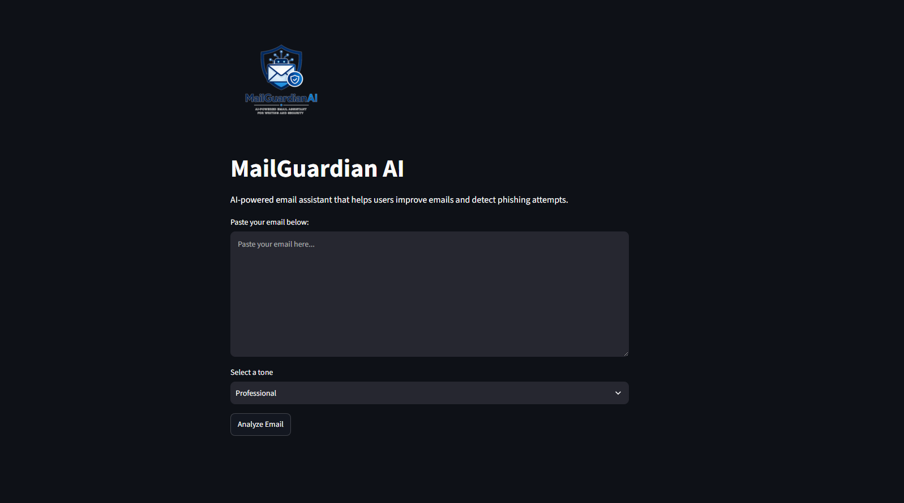
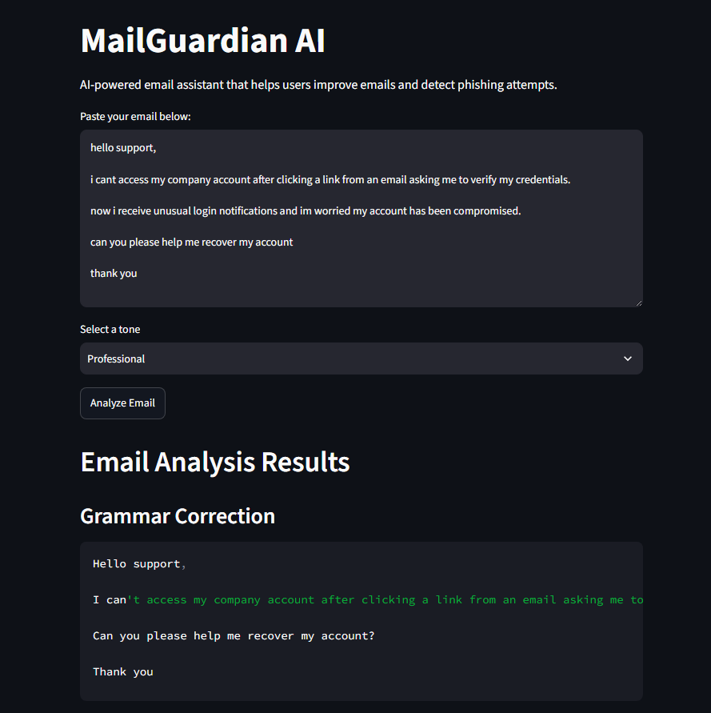
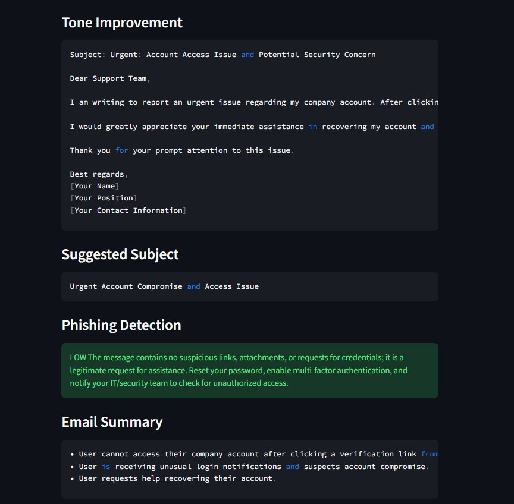

# MailGuardian AI
An AI-powered email assistant that helps users improve email quality and identify potential phishing attempts.
Built with **Python**, **Streamlit**, and **Largue Language Models** through the **OpenRouter API**

## Features
- Email grammar correction
- Tone improvement
- Subject generation
- Email summarization
- Clean and intuitive Streamlit interface
- Phishing detection

## Technologies

- Python 
- Streamlit
- OpenRouter API
- Large Language Models
- Git 
- Github
- Pytest 

## Project Structure

```text
mailguardian-ai/
│
├── assets/        # Images and project resources
├── docs/          # Project documentation
├── modules/       # AI feature modules
├── tests/         # Unit tests
├── utils/         # Utility functions
│
├── app.py         # Streamlit application
├── requirements.txt
└── README.md
```
## Installation

Clone the repository:

```bash
git clone https://github.com/djc1416/mailguardian-ai
```

Navigate to the project directory:

```bash
cd mailguardian-ai
```

Install the dependencies:

```bash
pip install -r requirements.txt
```

Run the application:

```bash
streamlit run app.py
```

## Usage

1. Launch the Streamlit application.
2. Paste an email into the text area.
3. Click **Analyze Email**.
4. Review the AI-generated results:
   - Grammar Correction
   - Tone Improvement
   - Suggested Subject
   - Phishing Detection
   - Email Summary

## Screenshots

### Home Page



### Analysis Results (Part 1)


### Analysis Results (Part 2)


## Architecture

For more details about the project architecture, see the documentation:

- [Architecture Documentation](docs/architecture.md)

## Roadmap

Future improvements and planned features are available here:

- [Project Roadmap](docs/roadmap.md)